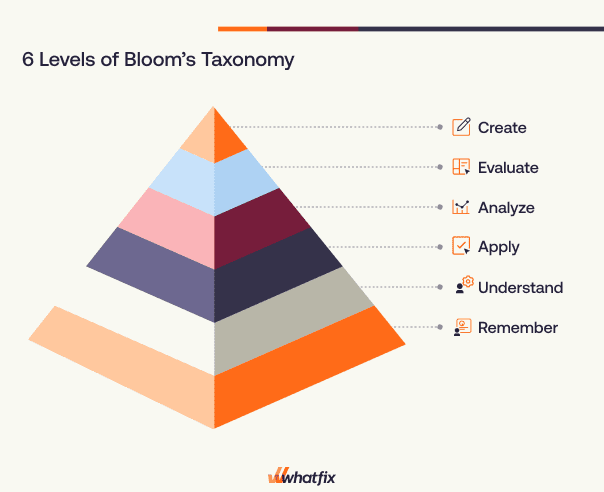

# BSSC_QA Framework: Complete Technical Report

**Author**: Shah Imran.  
**Date**: November 2025  
**Version**: 0.01

---

## Table of Contents

1. [Framework Overview](#1-framework-overview)
2. [Architecture & Design](#2-architecture--design)
3. [Core Components](#3-core-components)
4. [Agents System](#4-agents-system)
5. [Tools System](#5-tools-system)
6. [Pipeline System](#6-pipeline-system)
7. [Configuration System](#7-configuration-system)
8. [Vector Database & Embeddings](#8-vector-database--embeddings)
9. [Advanced Features](#9-advanced-features)
10. [Workflow & Execution](#10-workflow--execution)

---

## 1. Framework Overview

### Purpose
BSSC_QA is an intelligent, agentic framework for **automated Question-Answer pair generation** from documents. It transforms unstructured text into high-quality QA datasets using a multi-agent system powered by multiple LLM providers.

### Key Features
- 🤖 **Multi-agent architecture** (Generator, Synthesizer, Evaluator)
- 🔄 **Multi-LLM support** (Gemini, DeepSeek, Mistral, HuggingFace)
- 💾 **Local vector storage** with ChromaDB
- 📝 **Multi-format documents** (TXT, PDF, HTML, DOCX, URLs)
- ⚙️ **Fully config-driven** - no code changes needed
- 📊 **Quality metrics and validation**
- 🎓 **Bloom's taxonomy support** (optional)

### Technology Stack
```
LangChain 1.0      - Agent orchestration framework
LangGraph 0.2      - Agent workflow graphs
ChromaDB 0.5       - Vector database
Pydantic 2.0       - Configuration validation
Sentence-BERT      - Text embeddings
```

---

## 2. Architecture & Design

### High-Level Architecture
   

### Agent Workflow

```
┌─────────────┐
│   Chunk     │
│   Input     │
└──────┬──────┘
       │
       ▼
┌─────────────────────────────────────┐
│      Generator Agent                │
│  • Analyzes chunk content           │
│  • Generates diverse questions      │
│  • Uses chunk analysis tool         │
└──────┬──────────────────────────────┘
       │ Questions
       ▼
┌─────────────────────────────────────┐
│      Synthesis Agent                │
│  • Retrieves evidence from DB       │
│  • Synthesizes comprehensive answer │
│  • Maintains factual accuracy       │
└──────┬──────────────────────────────┘
       │ QA Pair
       ▼
┌─────────────────────────────────────┐
│      Evaluator Agent                │
│  • Rule-based validation            │
│  • LLM-based quality assessment     │
│  • Multi-dimensional scoring        │
└──────┬──────────────────────────────┘
       │
       ▼
┌─────────────┐
│  Validated  │
│  QA Pair    │
└─────────────┘
```

---

## 3. Core Components

### 3.1 Configuration System (`core/config.py`)

#### Purpose
Manages all framework settings using Pydantic models for type-safe configuration.

#### Key Classes

**LLMProviderConfig**
```python
class LLMProviderConfig(BaseModel):
    api_key: Optional[str] = None      # API key (prefer env vars)
    model: str                          # Model identifier
    temperature: float = 0.7            # Sampling temperature
    env_var: Optional[str] = None       # Environment variable name
```

**Configuration Structure**
```python
Config
├── llm: LLMConfig
│   ├── default_provider: str
│   └── providers: Dict[str, LLMProviderConfig]
├── vector_store: VectorStoreConfig
│   ├── type: str
│   ├── persist_directory: str
│   ├── collection_name: str
│   └── embedding_model: str
├── chunking: ChunkingConfig
│   ├── chunk_size: int = 512
│   ├── chunk_overlap: int = 50
│   └── auto_adjust: bool = True
├── agents: AgentsConfig
│   ├── generator
│   ├── synthesis
│   └── evaluator
├── bloom_level: Dict
└── human_review: Dict
```

#### Key Features
- Environment variable resolution with fallback to config
- Security warnings for hardcoded API keys
- Pydantic validation for type safety
- Dict-style access for backward compatibility

---

### 3.2 LLM Factory (`core/llm_factory.py`)

#### Purpose
Creates LLM instances for different providers with unified interface.

#### Supported Providers

**1. Gemini (Google)**
```python
ChatGoogleGenerativeAI(
    model="gemini-2.0-flash-exp",
    google_api_key=api_key,
    temperature=0.7
)
```

**2. DeepSeek**
```python
ChatOpenAI(
    model="deepseek-chat",
    api_key=api_key,
    base_url="https://api.deepseek.com/v1",
    temperature=0.7
)
```

**3. Mistral**
```python
ChatOpenAI(
    model="mistral-large-latest",
    api_key=api_key,
    base_url="https://api.mistral.ai/v1",
    temperature=0.7
)
```

**4. HuggingFace**
```python
HuggingFaceEndpoint(
    repo_id="meta-llama/Llama-3.1-8B-Instruct",
    huggingfacehub_api_token=api_key,
    temperature=0.7
)
```

#### Function Signature
```python
def create_llm(
    provider: str,
    api_key: str,
    model: str,
    temperature: float = 0.7
) -> Any
```

---

### 3.3 Embeddings (`core/embeddings.py`)

#### Purpose
Provides lightweight, offline-friendly text embeddings for vector storage.

#### OfflineHashEmbeddings Class

**Key Features**:
- No network downloads required
- Deterministic hash-based vectors
- Normalized L2 embeddings
- Configurable dimensions (default: 384)

**Algorithm**:
1. Tokenize text using regex pattern `\w+`
2. Hash each token using SHA-1
3. Map hash to vector dimension
4. Increment bucket for each token
5. L2 normalize the vector

**Code Snippet**:
```python
def _embed_text(self, text: str) -> List[float]:
    vector = [0.0] * self.dimension
    tokens = self._token_pattern.findall(text.lower())
    
    for token in tokens:
        index = self._hash_token(token)
        vector[index] += 1.0
    
    # L2 normalization
    norm = math.sqrt(sum(v * v for v in vector))
    if norm:
        vector = [v / norm for v in vector]
    
    return vector
```

**Advantages**:
- Fast computation
- No model downloads
- Consistent results
- Good for development/testing

**Limitations**:
- Less semantic accuracy than BERT
- No pre-training benefits

---

### 3.4 Vector Store Manager (`core/vector_store.py`)

#### Purpose
Manages ChromaDB operations with embedding integration.

#### Key Features

**Initialization**
```python
VectorStoreManager(
    persist_directory="./data/chroma_db",
    collection_name="bssc_chunks",
    embedding_model="offline-hash",  # or HuggingFace model
    embedding_dimension=384
)
```

**Operations**

1. **Add Documents**
```python
doc_ids = vs_manager.add_documents([
    Document(
        page_content="Text content...",
        metadata={"source": "file.txt", "chunk_id": "abc123"}
    )
])
```

2. **Similarity Search**
```python
results = vs_manager.similarity_search(
    query="travel destinations",
    k=3  # Top 3 results
)
```

3. **Collection Management**
```python
count = vs_manager.get_collection_count()
vs_manager.reset_collection()  # Clear all documents
```

**Collection Name Sanitization**:
- Removes invalid characters
- Ensures minimum 3 chars
- Truncates to 512 chars
- Preserves alphanumeric, dots, underscores, hyphens

---

## 4. Agents System

### 4.1 Generator Agent (`agents/generator_agent.py`)

#### Objective
Generate **diverse, high-quality questions** from text chunks using content analysis.

#### Inputs
- `chunk_text` (str): Source text content
- `count` (int): Number of questions to generate (default: 3)

#### Tools
1. **Analyze Content Tool**
   - Analyzes chunk for entities, numbers, structure
   - Suggests appropriate question types
   - Returns formatted analysis string

2. **Retrieval Tool** (optional)
   - Access to vector database
   - For context-aware question generation

#### System Prompt
```
You are an expert question generator. Your task is to create high-quality, 
diverse questions from given text content.

Guidelines:
1. Questions should be clear, specific, and answerable from the content
2. Vary question types: factual, conceptual, analytical
3. Ask about key concepts, entities, and relationships
4. Ensure questions test understanding, not just recall
5. Each question should be complete and grammatically correct

Output format for each question:
{
  "question": "Your question here?",
  "type": "factual|conceptual|analytical",
  "rationale": "Why this question is valuable"
}
```

#### Output Format
```python
[
    {
        "question_id": "uuid-string",
        "question": "What is the historical significance?",
        "question_type": "conceptual",
        "rationale": "Tests understanding of context",
        "chunk_text": "Original chunk snippet..."
    }
]
```

#### Implementation Details

**Question Parsing**:
1. Extract JSON objects from LLM response
2. Fallback to regex pattern matching for questions ending with `?`
3. Generate UUIDs for question tracking
4. Store chunk snippet for reference

**Question Types**:
- **Factual**: Who, what, where, when questions
- **Conceptual**: Why, how questions requiring understanding
- **Analytical**: Questions requiring analysis and synthesis

---

### 4.2 Synthesis Agent (`agents/synthesis_agent.py`)

#### Objective
Generate **accurate, comprehensive answers** based on retrieved evidence from the vector database.

#### Inputs
- `question` (str): The question to answer
- `question_type` (str): Type of question (factual, conceptual, analytical)

#### Tools
- **Vector Store Manager**: For evidence retrieval (used internally)

#### System Prompt
```
You are an expert answer synthesizer. Your task is to create accurate, 
comprehensive answers based on provided evidence.

Guidelines:
1. Base answers strictly on the evidence provided
2. Be clear, concise, and well-structured
3. Include relevant details and context
4. Maintain factual accuracy
5. Match answer complexity to question complexity

Your answer should:
- Directly address the question
- Use evidence to support claims
- Be complete but not unnecessarily verbose
```

#### Workflow

1. **Evidence Retrieval**
```python
evidence_docs = vs_manager.similarity_search(
    question,
    k=max_evidence_spans  # Default: 3
)
```

2. **Evidence Formatting**
```
[Evidence 1]
<content from doc 1>

[Evidence 2]
<content from doc 2>

[Evidence 3]
<content from doc 3>
```

3. **Answer Generation**
- Constructs prompt with question, type, and evidence
- Invokes LLM to synthesize answer
- Returns structured QA pair

#### Output Format
```python
{
    "qa_id": "uuid-string",
    "question": "Original question",
    "answer": "Synthesized answer based on evidence",
    "evidence_spans": ["Evidence text 1", "Evidence text 2", ...],
    "chunk_ids": ["chunk_id_1", "chunk_id_2", ...],
    "question_type": "factual|conceptual|analytical"
}
```

---

### 4.3 Evaluator Agent (`agents/evaluator_agent.py`)

#### Objective
**Assess QA pair quality** across multiple dimensions using both rule-based and LLM-based evaluation.

#### Inputs
- `qa` (Dict): QA pair with question, answer, and evidence

#### Tools
- **Validation Tool**: For rule-based quality checks

#### Configuration
- `quality_threshold` (float): Minimum acceptable score (default: 0.75)

#### System Prompt
```
You are a quality evaluation expert. Your task is to assess QA pairs 
across multiple dimensions and provide detailed scores.

Evaluation Criteria:
1. Relevance (0-1): Does the answer address the question?
2. Clarity (0-1): Are both Q&A clear and unambiguous?
3. Completeness (0-1): Is the answer comprehensive?
4. Factuality (0-1): Is the answer accurate based on evidence?

Provide scores for each criterion and identify any issues.
```

#### Evaluation Process

**1. Rule-Based Validation**
```python
basic_validation = validator.validate_qa(
    qa['question'],
    qa['answer']
)
```

Checks:
- Question/answer length
- Question mark presence
- Keyword overlap
- Answer completeness

**2. LLM-Based Evaluation**
- Constructs prompt with QA pair and evidence
- Requests scores for: relevance, clarity, completeness, factuality
- Parses scores from LLM response

**3. Score Combination**
```python
combined_scores = {
    **basic_validation.scores,
    **llm_scores
}

overall_score = sum(combined_scores.values()) / len(combined_scores)
passed = overall_score >= quality_threshold
```

#### Output Format
```python
{
    **qa,  # Original QA pair
    'scores': {
        'relevance': 0.95,
        'clarity': 0.92,
        'completeness': 0.88,
        'factuality': 0.94,
        'length': 1.0,
        'format': 1.0
    },
    'overall_score': 0.92,
    'flags': [],  # Quality issues
    'passed': True
}
```

#### Quality Flags
- `question_too_short`
- `question_too_long`
- `answer_too_short`
- `missing_question_mark`
- `answer_too_brief`
- `llm_evaluation_failed`

---

## 5. Tools System

### 5.1 Chunk Analysis Tool (`tools/chunk_tool.py`)

#### Purpose
Analyze text chunks to understand content and suggest appropriate question types.

#### Key Methods

**1. analyze_chunk(chunk_text: str) → Dict**

Extracts:
- Sentence count (English and Bengali punctuation)
- Word count
- Named entities (capitalized words, Bengali script)
- Numbers (potential facts)
- Question indicators (English and Bengali question words)

**Analysis Output**:
```python
{
    'sentence_count': 15,
    'word_count': 250,
    'entities': ['Bangladesh', 'Dhaka', 'পুটনী'],
    'has_numbers': True,
    'number_count': 5,
    'potential_topics': 8,
    'question_potential': True
}
```

**2. suggest_question_types(analysis: Dict) → List[str]**

Suggestion Logic:
```python
if potential_topics > 2:
    suggestions.append('factual')

if has_numbers:
    suggestions.append('quantitative')

if sentence_count >= 5:
    suggestions.append('conceptual')

if word_count > 100:
    suggestions.append('analytical')
```


---

### 5.2 Retrieval Tool (`tools/retrieval_tool.py`)

#### Purpose
Provide agents with access to vector database for context retrieval.

#### Key Methods

**retrieve_context(query: str, k: int = 5) → str**

Process:
1. Query vector store with similarity search
2. Format results with metadata
3. Return structured string

**Output Format**:
```
[Chunk 1]
Source: filename.txt
Position: 5
Content: <chunk content>

[Chunk 2]
Source: filename.txt
Position: 6
Content: <chunk content>
...
```

**get_tool() → StructuredTool**

Converts method to LangChain tool for agent use:
```python
StructuredTool.from_function(
    func=self.retrieve_context,
    name="retrieve_context",
    description="Retrieve relevant text chunks for a given query."
)
```

---

### 5.3 Validation Tool (`tools/validation_tool.py`)

#### Purpose
Perform rule-based quality assessment of QA pairs.

#### ValidationResult Data Class
```python
@dataclass
class ValidationResult:
    scores: Dict[str, float]     # Individual metric scores
    overall_score: float          # Average of all scores
    flags: List[str]              # Quality issues
    passed: bool                  # Meets threshold?
```

#### Validation Metrics

**1. Length Checks**
- Question: 10-300 chars ideal
- Answer: 20+ chars required

**2. Format Checks**
- Question must end with `?`
- Proper sentence structure

**3. Relevance Check**
- Keyword overlap between Q&A
- Scored as: `min(overlap * 2, 1.0)`

**4. Completeness Check**
- Answer word count
- Thresholds:
  - < 5 words: score 0.3
  - 5-15 words: score 0.6
  - 15+ words: score 1.0

#### Score Calculation
```python
overall_score = sum(scores.values()) / len(scores)
passed = overall_score >= quality_threshold
```

---

## 6. Pipeline System

### 6.1 Document Loaders (`pipeline/document_loaders.py`)

#### Purpose
Load documents from multiple formats into unified structure.

#### Supported Formats

**1. Text Files (.txt)**
```python
def load_txt(file_path: Path) → Dict[str, Any]:
    with open(file_path, 'r', encoding='utf-8') as f:
        content = f.read()
    return {
        'content': content,
        'metadata': {
            'source': str(file_path),
            'filename': file_path.name,
            'format': 'txt'
        }
    }
```

**2. PDF Files (.pdf)**
```python
def load_pdf(file_path: Path) → Dict[str, Any]:
    reader = PdfReader(file_path)
    content = ''
    for page in reader.pages:
        content += page.extract_text() + '\n\n'
    return {
        'content': content,
        'metadata': {
            'source': str(file_path),
            'filename': file_path.name,
            'format': 'pdf',
            'pages': len(reader.pages)
        }
    }
```

**3. HTML Files (.html, .htm)**
```python
def load_html(file_path: Path) → Dict[str, Any]:
    with open(file_path, 'r', encoding='utf-8') as f:
        html_content = f.read()
    
    soup = BeautifulSoup(html_content, 'html.parser')
    
    # Remove script and style elements
    for script in soup(["script", "style"]):
        script.decompose()
    
    content = soup.get_text()
    return {
        'content': content,
        'metadata': {...}
    }
```

**4. DOCX Files (.docx)**
```python
def load_docx(file_path: Path) → Dict[str, Any]:
    doc = Document(file_path)
    content = '\n\n'.join([
        para.text for para in doc.paragraphs 
        if para.text.strip()
    ])
    return {
        'content': content,
        'metadata': {
            'paragraphs': len(doc.paragraphs)
        }
    }
```

**5. URLs**
```python
def load_url(url: str) → Dict[str, Any]:
    response = requests.get(url, timeout=10)
    soup = BeautifulSoup(response.content, 'html.parser')
    # Extract text similar to HTML
```

---

### 6.2 Chunking System (`pipeline/chunking.py`)

#### Purpose
Split text into overlapping chunks based on token size for optimal processing.

#### Chunk Data Class
```python
@dataclass
class Chunk:
    chunk_id: str           # UUID
    text: str               # Chunk content
    tokens: int             # Estimated tokens
    position: int           # Position in document
    metadata: Dict[str, Any] # Source metadata
```

#### Chunking Algorithm

**Parameters**:
- `chunk_size`: Target tokens per chunk (default: 512)
- `chunk_overlap`: Tokens to overlap (default: 50)
- `min_chunk_chars`: Minimum chunk size (200 chars)

**Process**:

1. **Token Estimation**
```python
def estimate_tokens(text: str) → int:
    return len(text) // 4  # 1 token ≈ 4 chars
```

2. **Character Conversion**
```python
char_size = chunk_size * 4      # 512 → 2048 chars
char_overlap = chunk_overlap * 4 # 50 → 200 chars
```

3. **Smart Boundary Detection**
```python
# Look for sentence endings in last 20% of chunk
delimiters = ['. ', '! ', '? ', '।। ', '।।', '। ', '।', '\n\n']
search_start = len(chunk) - int(char_size * 0.2)

for delimiter in delimiters:
    last_delim = chunk.rfind(delimiter, search_start)
    if last_delim != -1:
        chunk = chunk[:last_delim + len(delimiter)]
        break
```

4. **Tiny Chunk Merging**
```python
if len(stripped_chunk) < min_chunk_chars and chunks:
    # Merge with previous chunk for better context
    previous_chunk.text = f"{previous_chunk.text} {stripped_chunk}"
    previous_chunk.tokens = estimate_tokens(merged_text)
```

5. **Overlap Handling**
```python
# Move to next chunk with overlap
move_amount = max(chunk_length - char_overlap, 1)
start = start + move_amount
```

#### Bengali Support
- Bengali sentence endings: `। `, `।।`, `।। `
- Proper Unicode handling for Bengali text
- Context preservation across chunks

---

### 6.3 Ingestion Pipeline (`pipeline/ingestion.py`)

#### Purpose
Manage complete document ingestion process from loading to vector storage.

#### Key Methods

**1. ingest_document(source: str) → List[str]**

Process Flow:
```
Load Document
     ↓
Clean Text
     ↓
Normalize Text
     ↓
Chunk Text
     ↓
Create LangChain Documents
     ↓
Add to Vector Store
     ↓
Return Document IDs
```

Implementation:
```python
def ingest_document(self, source: str) → List[str]:
    # Load
    doc_data = load_document(source)
    
    # Clean & Normalize
    content = clean_text(doc_data['content'])
    content = normalize_text(content)
    
    # Chunk
    chunks = chunk_text(
        content,
        chunk_size=self.chunk_size,
        chunk_overlap=self.chunk_overlap,
        metadata=doc_data['metadata']
    )
    
    # Convert to LangChain Documents
    documents = [
        Document(
            page_content=chunk.text,
            metadata={
                **chunk.metadata,
                'chunk_id': chunk.chunk_id,
                'tokens': chunk.tokens,
                'position': chunk.position
            }
        )
        for chunk in chunks
    ]
    
    # Store
    doc_ids = self.vs_manager.add_documents(documents)
    return doc_ids
```

**2. ingest_directory(directory, pattern, max_files) → Dict**

Batch ingestion with progress tracking:
```python
results = {
    'total_files': len(files),
    'processed': 0,
    'failed': 0,
    'total_chunks': 0,
    'errors': []
}

for file_path in tqdm(files):
    try:
        doc_ids = self.ingest_document(str(file_path))
        results['processed'] += 1
        results['total_chunks'] += len(doc_ids)
    except Exception as e:
        results['failed'] += 1
        results['errors'].append({
            'file': str(file_path),
            'error': str(e)
        })
```

---

### 6.4 Pipeline Orchestrator (`pipeline/orchestrator.py`)

#### Purpose
Orchestrate the complete QA generation pipeline across all agents.

#### Key Methods

**generate_qa_from_chunks(num_chunks, questions_per_chunk) → Dict**

Complete Pipeline Flow:
```
Get Sample Chunks
       ↓
For Each Chunk:
  ├── Generator Agent → Questions
  ├── For Each Question:
  │     ├── Synthesis Agent → Answer
  │     └── Evaluator Agent → Scores
  └── Store Results
       ↓
Calculate Statistics
       ↓
Return Results
```

Implementation:
```python
def generate_qa_from_chunks(
    self,
    num_chunks: int = 10,
    questions_per_chunk: int = 3
) → Dict[str, Any]:
    
    results = {
        'total_chunks': num_chunks,
        'total_questions_attempted': 0,
        'total_qa_pairs': 0,
        'passed_qa_pairs': 0,
        'failed_qa_pairs': 0,
        'qa_pairs': [],
        'statistics': {}
    }
    
    # Get chunks
    chunks = self._get_sample_chunks(num_chunks)
    
    # Process each chunk
    for chunk in tqdm(chunks):
        # Generate questions
        questions = self.generator.generate_questions(
            chunk.page_content,
            count=questions_per_chunk
        )
        
        results['total_questions_attempted'] += len(questions)
        
        # Synthesize answers
        for question in questions:
            qa_pair = self.synthesizer.synthesize_answer(
                question['question'],
                question['question_type']
            )
            
            # Evaluate quality
            evaluated_qa = self.evaluator.evaluate_qa(qa_pair)
            
            results['total_qa_pairs'] += 1
            if evaluated_qa['passed']:
                results['passed_qa_pairs'] += 1
                results['qa_pairs'].append(evaluated_qa)
            else:
                results['failed_qa_pairs'] += 1
    
    # Calculate statistics
    results['statistics'] = self._calculate_statistics(results)
    
    return results
```

**Chunk Sampling Strategy**:
```python
def _get_sample_chunks(self, num_chunks: int) → List:
    queries = [
        "travel destination",
        "historical place",
        "tourist attraction",
        "cultural site",
        "natural beauty"
    ]
    
    chunks = []
    chunks_per_query = max(num_chunks // len(queries), 1)
    
    for query in queries:
        results = self.vs_manager.similarity_search(
            query,
            k=chunks_per_query
        )
        chunks.extend(results)
```

**Statistics Calculation**:
```python
def _calculate_statistics(self, results: Dict) → Dict:
    stats = {
        'pass_rate': results['passed_qa_pairs'] / results['total_qa_pairs'],
        'average_score': mean([qa['overall_score'] for qa in results['qa_pairs']]),
        'question_type_distribution': {
            'factual': count_type('factual'),
            'conceptual': count_type('conceptual'),
            'analytical': count_type('analytical')
        }
    }
    return stats
```

**Export Functionality**:
```python
def export_results(self, results: Dict, output_path: str):
    export_data = {
        'metadata': {
            'total_qa_pairs': results['passed_qa_pairs'],
            'statistics': results['statistics']
        },
        'qa_pairs': [
            {
                'question': qa['question'],
                'answer': qa['answer'],
                'evidence': qa['evidence_spans'],
                'scores': qa['scores'],
                'overall_score': qa['overall_score']
            }
            for qa in results['qa_pairs']
        ]
    }
    
    with open(output_path, 'w', encoding='utf-8') as f:
        json.dump(export_data, f, indent=2, ensure_ascii=False)
```

---

## 7. Configuration System

### Configuration File Structure

```json
{
  "llm": {
    "default_provider": "gemini",
    "providers": {
      "gemini": {
        "api_key": "YOUR_API_KEY",
        "model": "gemini-2.0-flash-exp",
        "temperature": 0.7
      },
      "deepseek": {
        "api_key": "YOUR_API_KEY",
        "model": "deepseek-chat",
        "temperature": 0.7
      },
      "mistral": {
        "api_key": "YOUR_API_KEY",
        "model": "mistral-large-latest",
        "temperature": 0.7
      },
      "huggingface": {
        "api_key": "YOUR_API_KEY",
        "model": "meta-llama/Llama-3.1-8B-Instruct",
        "temperature": 0.7
      }
    }
  },
  "vector_store": {
    "type": "chromadb",
    "persist_directory": "./data/chroma_db",
    "collection_name": "bssc_chunks",
    "embedding_model": "offline-hash",
    "embedding_dimension": 384
  },
  "chunking": {
    "chunk_size": 512,
    "chunk_overlap": 50,
    "auto_adjust": true
  },
  "agents": {
    "planner": {
      "enabled": false,
      "provider": "gemini"
    },
    "generator": {
      "provider": "gemini",
      "max_retries": 3
    },
    "synthesis": {
      "provider": "deepseek",
      "context_window": 3,
      "max_evidence_spans": 3
    },
    "evaluator": {
      "provider": "mistral",
      "quality_threshold": 0.75,
      "metrics": [
        "relevance",
        "clarity",
        "completeness",
        "factuality",
        "diversity"
      ]
    }
  },
  "bloom_level": {
    "enabled": false,
    "levels": [
      "remember",
      "understand",
      "apply",
      "analyze",
      "evaluate",
      "create"
    ]
  },
  "human_review": {
    "enabled": false,
    "review_threshold": 0.6
  },
  "export": {
    "format": "json",
    "include_metadata": true,
    "output_path": "./data/output"
  }
}
```

### Configuration Parameters Explained

#### LLM Configuration
- **default_provider**: Primary LLM to use (gemini|deepseek|mistral|huggingface)
- **providers**: API credentials and model settings for each provider
- **temperature**: Controls randomness (0.0 = deterministic, 1.0 = creative)

#### Vector Store Configuration
- **type**: Vector database type (currently only chromadb)
- **persist_directory**: Local storage path for database
- **collection_name**: Name of the document collection
- **embedding_model**: 
  - "offline-hash": Fast, no downloads
  - "sentence-transformers/all-MiniLM-L6-v2": High quality, requires download

#### Chunking Configuration
- **chunk_size**: Target tokens per chunk (recommended: 256-1024)
- **chunk_overlap**: Overlapping tokens for context (recommended: 10-20% of chunk_size)
- **auto_adjust**: Dynamically adjust based on document structure

#### Agent Configuration
- **planner.enabled**: Enable planning agent (future feature)
- **generator.provider**: LLM for question generation
- **generator.max_retries**: Retry attempts for failed generations
- **synthesis.provider**: LLM for answer synthesis
- **synthesis.max_evidence_spans**: Number of evidence chunks to retrieve
- **evaluator.provider**: LLM for quality evaluation
- **evaluator.quality_threshold**: Minimum acceptable score (0.0-1.0)

---

## 8. Vector Database & Embeddings

### ChromaDB Architecture

```
┌─────────────────────────────────────┐
│        ChromaDB Collection          │
├─────────────────────────────────────┤
│                                     │
│  Document 1                         │
│  ├── Vector: [0.15, 0.82, ...]     │
│  ├── Text: "Bangladesh is..."      │
│  └── Metadata:                      │
│      ├── source: "file.txt"        │
│      ├── chunk_id: "abc-123"       │
│      ├── position: 0               │
│      └── tokens: 128               │
│                                     │
│  Document 2                         │
│  ├── Vector: [0.72, 0.31, ...]     │
│  ├── Text: "The Oxford Mission..." │
│  └── Metadata: {...}                │
│                                     │
│  ...                                │
│                                     │
└─────────────────────────────────────┘
```

### Embedding Options

#### Option 1: Offline Hash Embeddings
**Pros**:
- No internet required
- Fast computation
- No model downloads
- Deterministic

**Cons**:
- Lower semantic accuracy
- No pre-training benefits

**Use Case**: Development, testing, resource-constrained environments

#### Option 2: Sentence Transformers
**Model**: `sentence-transformers/all-MiniLM-L6-v2`

**Pros**:
- High semantic accuracy
- Pre-trained on diverse data
- Good for production

**Cons**:
- Requires model download (~90MB)
- Slower computation

**Use Case**: Production deployment, high-quality retrieval

### Similarity Search

**Process**:
1. Query text → Embedding vector
2. Compute cosine similarity with all stored vectors
3. Return top-k most similar documents
4. Include metadata for each result

**Example**:
```python
results = vs_manager.similarity_search(
    query="travel destinations in Bangladesh",
    k=5
)

for result in results:
    print(f"Score: {result.score}")
    print(f"Source: {result.metadata['source']}")
    print(f"Text: {result.page_content[:100]}...")
```

---

## 9. Advanced Features

### 9.1 Bloom's Taxonomy Support

#### Overview
Bloom's Taxonomy is a hierarchical model for classifying educational learning objectives into levels of complexity.



#### Cognitive Levels
```
CREATE      ▲  Highest cognitive complexity
EVALUATE    │  Design, construct, produce
ANALYZE     │  Judge, critique, assess
APPLY       │  Compare, organize, deconstruct
UNDERSTAND  │  Execute, implement, use
REMEMBER    ▼  Explain, summarize, interpret
            Lowest cognitive complexity (Recall facts)
```

#### Configuration
```json
{
  "bloom_level": {
    "enabled": true,
    "levels": [
      "remember",
      "understand",
      "apply",
      "analyze",
      "evaluate",
      "create"
    ]
  }
}
```

#### Implementation Strategy

When enabled, the Generator Agent prompt is modified to:

1. **Target Specific Levels**
```
Generate questions at the following Bloom's taxonomy levels:
- Remember: Recall facts and basic concepts
- Understand: Explain ideas or concepts
- Apply: Use information in new situations
- Analyze: Draw connections among ideas
- Evaluate: Justify a decision or course of action
- Create: Produce new or original work
```

2. **Distribute Question Types**
```python
# Example distribution
bloom_distribution = {
    'remember': 1,      # 1 factual question
    'understand': 2,    # 2 conceptual questions
    'apply': 1,         # 1 application question
    'analyze': 1,       # 1 analytical question
}
```

3. **Question Validation**
- Evaluator checks if questions match intended Bloom level
- Adds `bloom_level` field to metadata
- Tracks distribution in statistics

#### Example Questions by Level

**Remember**: "What is the Oxford Mission Church?"
**Understand**: "Why is the Oxford Mission Church significant in Bangladesh?"
**Apply**: "How would you plan a visit to the Oxford Mission Church?"
**Analyze**: "Compare the architectural features of the Oxford Mission Church with other colonial buildings."
**Evaluate**: "Assess the cultural impact of the Oxford Mission Church on Barisal."
**Create**: "Design a heritage tour itinerary featuring the Oxford Mission Church."

---

### 9.2 Human Verification System

#### Overview
Optional human-in-the-loop review for low-confidence QA pairs before final approval.

#### Configuration
```json
{
  "human_review": {
    "enabled": true,
    "review_threshold": 0.6
  }
}
```

#### Workflow

```
┌─────────────────┐
│ Evaluator Agent │
└────────┬────────┘
         │
    Score < 0.6?
         │
    ┌────┴────┐
    │   Yes   │    No
    ▼         ▼
┌───────┐  ┌──────┐
│ Human │  │ Auto │
│Review │  │Accept│
└───┬───┘  └──────┘
    │
    ▼
┌───────────┐
│  Approve  │
│  Reject   │
│  Edit     │
└───────────┘
```

#### Implementation Approach

**1. Flag for Review**
```python
if qa_pair['overall_score'] < review_threshold:
    qa_pair['requires_human_review'] = True
    qa_pair['review_reason'] = determine_reason(qa_pair)
```

**2. Review Interface** (To be implemented)
```
┌─────────────────────────────────────┐
│  QA Pair Review                     │
├─────────────────────────────────────┤
│ Score: 0.58 (Below threshold)       │
│                                     │
│ Question:                           │
│ [Editable text box]                 │
│                                     │
│ Answer:                             │
│ [Editable text box]                 │
│                                     │
│ Evidence:                           │
│ [Display evidence snippets]         │
│                                     │
│ Scores:                             │
│ - Relevance: 0.45 ❌                │
│ - Clarity: 0.85 ✓                   │
│ - Completeness: 0.60                │
│                                     │
│ [Approve] [Edit] [Reject]           │
└─────────────────────────────────────┘
```

**3. Review Actions**
- **Approve**: Accept despite low score
- **Edit**: Modify question/answer and re-evaluate
- **Reject**: Exclude from final dataset

**4. Review Tracking**
```python
review_log = {
    'qa_id': 'uuid',
    'original_score': 0.58,
    'review_action': 'edit',
    'edited_fields': ['answer'],
    'final_score': 0.82,
    'reviewer': 'human_1',
    'timestamp': '2025-11-01T12:00:00'
}
```

#### Benefits
- Quality assurance for edge cases
- Human judgment for ambiguous content
- Training data for improving thresholds
- Compliance with quality standards

---

## 10. Workflow & Execution

### Complete Pipeline Execution

```
┌──────────────────────────────────────────────────────────────┐
│                    BSSC_QA Pipeline                          │
└──────────────────────────────────────────────────────────────┘

Phase 1: Document Ingestion
├── Load Documents (TXT, PDF, HTML, DOCX, URL)
├── Clean & Normalize Text
├── Intelligent Chunking (with overlap)
├── Generate Embeddings
└── Store in ChromaDB
     │
     ▼
Phase 2: QA Generation
├── Sample Chunks (diverse queries)
│
├── For Each Chunk:
│   │
│   ├── Generator Agent
│   │   ├── Analyze Chunk Content
│   │   ├── Suggest Question Types
│   │   └── Generate N Questions
│   │        │
│   │        ▼
│   ├── Synthesis Agent
│   │   ├── Retrieve Evidence (Vector Search)
│   │   ├── Format Context
│   │   └── Generate Answer
│   │        │
│   │        ▼
│   └── Evaluator Agent
│       ├── Rule-Based Validation
│       ├── LLM Quality Assessment
│       ├── Score Combination
│       └── Pass/Fail Decision
│            │
│            ▼
└── Aggregate Results
     │
     ▼
Phase 3: Post-Processing
├── Calculate Statistics
├── Filter by Quality Threshold
├── Optional: Human Review
└── Export to JSON
```

### Usage Example

```python
from bssc_qa import QAPipelineOrchestrator
from core.config import load_config
from core.llm_factory import create_llm
from core.vector_store import VectorStoreManager
from agents.generator_agent import GeneratorAgent
from agents.synthesis_agent import SynthesisAgent
from agents.evaluator_agent import EvaluatorAgent
from tools import RetrievalTool, ChunkAnalysisTool, ValidationTool

# 1. Load Configuration
cfg = load_config('config.json')

# 2. Initialize Vector Store
vs_manager = VectorStoreManager(
    persist_directory=cfg.vector_store.persist_directory,
    collection_name=cfg.vector_store.collection_name,
    embedding_model=cfg.vector_store.embedding_model
)

# 3. Ingest Documents (one-time)
from pipeline.ingestion import IngestionPipeline

pipeline = IngestionPipeline(vs_manager, chunk_size=512)
results = pipeline.ingest_directory(
    directory='data/documents',
    pattern='*.txt',
    max_files=50
)

# 4. Initialize Agents
# Generator
gen_llm = create_llm(
    cfg.llm.default_provider,
    cfg.llm.providers[cfg.llm.default_provider].api_key,
    cfg.llm.providers[cfg.llm.default_provider].model
)
retrieval_tool = RetrievalTool(vs_manager)
chunk_analyzer = ChunkAnalysisTool()
generator = GeneratorAgent(gen_llm, retrieval_tool, chunk_analyzer)

# Synthesis
syn_llm = create_llm(...)
synthesizer = SynthesisAgent(syn_llm, vs_manager)

# Evaluator
eval_llm = create_llm(...)
validator = ValidationTool()
evaluator = EvaluatorAgent(eval_llm, validator)

# 5. Create Orchestrator
orchestrator = QAPipelineOrchestrator(
    generator, synthesizer, evaluator, vs_manager, cfg
)

# 6. Generate QA Pairs
results = orchestrator.generate_qa_from_chunks(
    num_chunks=10,
    questions_per_chunk=3
)

# 7. Export Results
orchestrator.export_results(results, 'output/qa_dataset.json')

# 8. Review Statistics
print(f"Generated: {results['total_qa_pairs']} QA pairs")
print(f"Passed: {results['passed_qa_pairs']}")
print(f"Pass Rate: {results['statistics']['pass_rate']:.2%}")
print(f"Avg Score: {results['statistics']['average_score']:.2f}")
```

### Output Format

```json
{
  "metadata": {
    "total_qa_pairs": 28,
    "statistics": {
      "pass_rate": 0.933,
      "average_score": 0.87,
      "question_type_distribution": {
        "factual": 12,
        "conceptual": 10,
        "analytical": 6
      }
    }
  },
  "qa_pairs": [
    {
      "question": "What is the Oxford Mission Church?",
      "answer": "The Oxford Mission Church is the second largest church in Asia...",
      "evidence": [
        "The Oxford Mission Church, located in Barisal...",
        "It features beautiful Gothic architecture..."
      ],
      "scores": {
        "relevance": 0.95,
        "clarity": 0.92,
        "completeness": 0.88,
        "factuality": 0.94
      },
      "overall_score": 0.92
    }
  ]
}
```

---

### Project Structure

```
BSSC_QA/
├── bssc_qa/
│   └── src/
│       ├── core/              # Configuration, LLM, Vector Store
│       │   ├── config.py
│       │   ├── embeddings.py
│       │   ├── llm_factory.py
│       │   └── vector_store.py
│       ├── agents/            # Question Gen, Synthesis, Evaluation
│       │   ├── generator_agent.py
│       │   ├── synthesis_agent.py
│       │   └── evaluator_agent.py
│       ├── tools/             # Chunk Analysis, Retrieval, Validation
│       │   ├── chunk_tool.py
│       │   ├── retrieval_tool.py
│       │   └── validation_tool.py
│       ├── pipeline/          # Ingestion, Orchestration
│       │   ├── document_loaders.py
│       │   ├── chunking.py
│       │   ├── ingestion.py
│       │   └── orchestrator.py
│       └── utils/             # Text Processing
│           └── text_processing.py
├── data/
│   ├── chroma_db/            # Vector database
│   ├── travel_scraped/       # Input documents
│   └── output/               # Generated datasets
├── config.json               # Configuration file
├── requirements.txt          # Dependencies
└── README.md                # Documentation
```

---

**End of Report**
